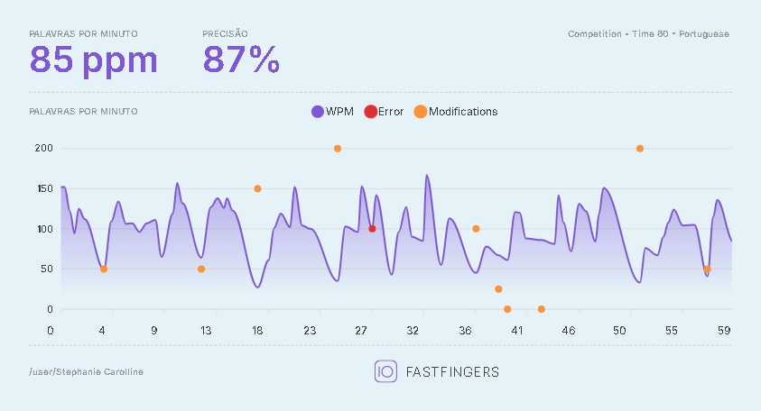
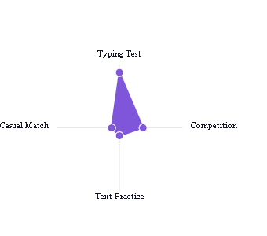

  

### Olá, sou a Stephanie! 👋

Bem-vindo(a) ao meu perfil! Sou **Engenheira de Dados** e **Instrutora de Tecnologia**, apaixonada por aprender, ensinar e proteger ecossistemas tecnológicos.

Graduada em **Análise e Desenvolvimento de Sistemas** e **Licenciatura em Letras (Português/Inglês)**, unindo bagagem técnica com facilidade didática.

Atualmente, meu foco principal está em **Segurança da Informação, Cybersecurity, Engenharia de Dados e IA Generativa**. Atuo ministrando tópicos de Segurança de Sistemas, Zero Trust, Criptografia e Governança de Dados Sensíveis, além de sustentar pipelines de dados em ambientes Cloud. 

Dedico meus estudos e projetos a **Cybersecurity**, **Engenharia de Dados** e **Desenvolvimento Orientado por Especificações (SDD)** — razão pela qual grande parte das minhas atividades técnicas está documentada em Jupyter Notebooks.

📫 **Contato**: [LinkedIn](https://www.linkedin.com/in/stephanie-amarante-ti)    

  

---

  

---

## 🏆 Certificações e Badges

| Plataforma | Acesso Rápido |
| :--- | :--- |
| **Microsoft Learn** |  |
| **Credly** |  |
| **Databricks** |  |

## ⚒️ Ferramentas e Tecnologias Aprendidas

  <table>
    <tr>
      <td align="center" width="96">
        
         Airflow
      </td>
      <td align="center" width="96">
        
         Azure
      </td>
      <td align="center" width="96">
        
         Docker
      </td>
      <td align="center" width="96">
        
         IntelliJ
      </td>
      <td align="center" width="96">
        
         MySQL
      </td>
    </tr>
    <tr>
      <td align="center" width="96">
        
         Colab
      </td>
      <td align="center" width="96">
        
         Jupyter
      </td>
      <td align="center" width="96">
        
         DBeaver
      </td>
      <td align="center" width="96">
        
         Git
      </td>
      <td align="center" width="96">
        
         GitHub
      </td>
    </tr>
    <tr>
      <td align="center" width="96">
        
         Google Cloud
      </td>
      <td align="center" width="96">
        
         Oracle
      </td>
      <td align="center" width="96">
        
         Postman
      </td>
      <td align="center" width="96">
        
         VS Code
      </td>
      <td align="center" width="96">
        
         UML
      </td>
    </tr>
  </table>

## 📚 Estou aprendendo

  <table>
    <tr>
      <td align="center" width="96">
        
         Python
      </td>
      <td align="center" width="96">
        
         TypeScript
      </td>
      <td align="center" width="96">
        
         React
      </td>
    </tr>
  </table>

## 🚀 Linguagens de Programação, Frameworks e Bibliotecas aprendidos

  <table>
    <tr>
      <!-- Linguagens -->
      <td align="center" width="96">
        
         Java
      </td>
      <td align="center" width="96">
        
         HTML5
      </td>
      <td align="center" width="96">
        
         CSS3
      </td>
      <td align="center" width="96">
        
         SQL
      </td>
    </tr>
    <tr>
      <td align="center" width="96">
        
         Bash
      </td>
      <td align="center" width="96">
        
         PHP
      </td>
      <td align="center" width="96">
        
         C
      </td>
      <!-- Frameworks -->
      <td align="center" width="96">
        
         Angular
      </td>
    </tr>
    <tr>
      <td align="center" width="96">
        
         Bootstrap
      </td>
      <!-- Bibliotecas -->
      <td align="center" width="96">
        
         SQLAlchemy
      </td>
      <td align="center" width="96">
        
         Matplotlib
      </td>
      <td align="center" width="96">
        
         NumPy
      </td>
    </tr>
  </table>

## ⌨️ Melhore sua Velocidade de Digitação

  <h3>⚡ Minha evolução no 10FastFingers</h3>
  
  <table border="0">
    <tr>
      <td align="center">
        
         
        <strong>85 WPM</strong> | 87% precisão
      </td>
      <td align="center">
        
         
        <strong>Progresso</strong> em competições
      </td>
    </tr>
  </table>
  
  

    🚀 <a href="https://10fastfingers.com/pt/user/steamarante">Meu perfil no 10FastFingers</a> | 
    <a href="https://10fastfingers.com/typing-test/portuguese">Teste de digitação</a>
  

